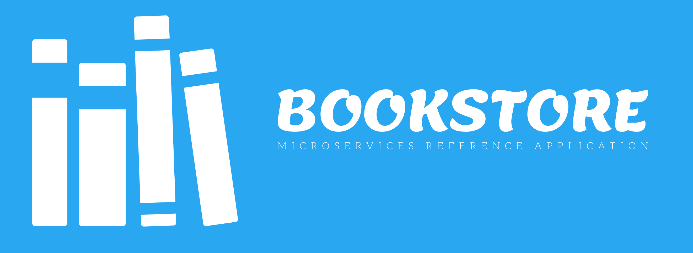

# Bookstore - Microservices Reference Application

> Polyglot microservices reference application using opensource technology stack like Docker and Kubernetes



The mian purpose of this repository is to demonstrate a polyglot micoservices reference architecture and best practices for containerized environments like Kubernetes. You can find an reference implementation showing all mordern day requirements you would expect from your platform using fully opensource technology stack. The core motivation behind putting together this repo is to have a open architecture, keep it up to date and relevant with the help of community.

## Motivation behind creating this Repo?

I was designing an architecture for one of our next generation internal application. The more I thought about the architecture, I realize how important is to have an open architecture which can evolve based on current industry trends, best practices and open ideas from the awesome community. We are using this repository as our architecture playground for all of our products and I hope it can definely help many organization who are trying to adopt microservices. Having a adoptable and future proof technology architecture is very critical for growing business now-a-days.

## System Architecture

You can find high level system architecture in below diagram. It reprents different components and opensource tools involved in the application and how they interact with each other. Although diagram says `Google Cloud Platform`, the application can be deployed to any cloud platform. Please visit [`deployment`](deployment) folder to find what all platforms are currently supported.


## Demonstration Video

Coming soon

## Getting Started

Interested to contribute to this project and not sure where to start? Please follow our detailed [`Getting started guide`](docs/getting-started.md) for environment setup or knowing repository structure. If you stuck anywhere or need any help from the community, feel free to create an `Issue` for discussion.

## Infrastructure

We are using `Terraform` as our infrastructure as code tool for this project. Initial plan is to provide `terraform` scripts for major cloud platforms to provision required resources.

For detailed information, head over to our [`Infrastructure Guide`](docs/infrastructure.md). The trraform scripts can be found at [`deployment/terraform`](deployment/terraform) directory.

## Deployment

This application can be deployed to any major cloud platform. We are providing all kuberenetes resources under [`deployment/kubernetes`](deployment/kubernetes) directory. Please refer to [`Deployment Guide`](docs/deployment.md) for more details.

If you want to run the full application with supporting tools such as database, redis, api-gateway, auth server on your local system, use the script provided at [`tools/docker-compose.sh`](tools/docker-compose.sh).

```bash
# Start all services
./tools/docker-compose.sh up

# Stop all services
./tools/docker-compose.sh down
```

## Micro Services with Language and Framework

1. Boostore Web Application - Typescript(Angular)
2. BookService - Java(Spring boot)
3. OrderService - Java(Spring boot)
4. RatingServie - NodeJS(Express)
5. PromotionService - Python(Flask)

## Technology Stack & Tools

- Docker
- Kubernetes
- Istio
- SpringBoot
- ExpressJS
- Flask
- Angular
- Keyclok
- Prometheus
- Grafana
- Loki
- Tempo
- Ambassador
- Helm
- ElasticSearch
- Redis
- PostgreSQL
- HashiCorp's Vault

## Expected Features

- [x] Cloud Native
- [X] Build once and run everywhere
- [ ] Continious Integration and Continious Delevery(CI/CD)
- [ ] Auto Scaling
- [ ] Centralised Configuration Management
- [ ] Service Discovery
- [ ] Dynamic Routing
- [ ] Distibuted Tracing
- [ ] Infracture Observability
- [ ] Application Insights and Metrics
- [ ] Circuit Breaker/Fault tolerance
- [ ] Centralised Logging
- [ ] Asynchonous Messaging
- [ ] Rate Limiting
- [ ] Load Balancing
- [ ] Retries and Timeouts
- [ ] TLS inter service communication
- [ ] API management
- [X] API Documentation
- [ ] API Analytics
- [ ] API Versioning
- [ ] Self Healing
- [ ] Distibuted Caching
- [ ] Backups and Disaster Recovery
- [ ] Security (Authentiation/Authorization)
- [ ] Efficient Search
- [ ] Adaptable to Change
- [ ] Reproducible

## Want to Contribute?

Your valuable contribution is always precious for us to keep this repository up to date and relevant. If you have some cool idea or new features requirement, please feel free to open a Github issue. We will discuss and take it up from there. For small changes or optimizations, direct pull request are always welcome. Appriciate your help in advance.

## Caution! :fire:

> For simplicity we have created mono repo with all services source code. Never do that in your actual project, use separate repository for individual services instead.
