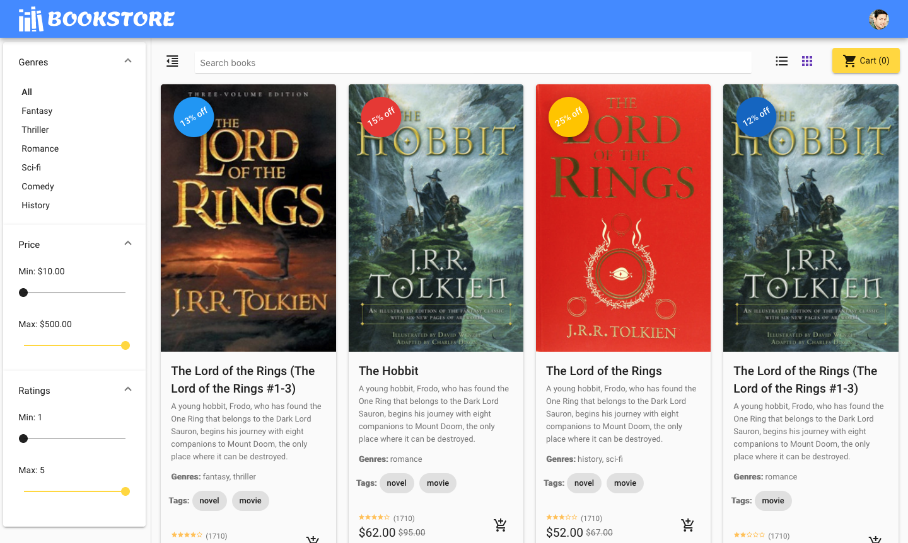

# System Architecture

> This document describes High Level Architecture design for the bookstore application.

As you can see in above diagram, we have base compute, network and storage layer provided by Cloud provider(In our case GCP). This layer can be refered as Infrastructure as a Service(IaaS).

Kubernetes and Istio cluster running on top of base layer which acts as an Platform as a Service(PaaS) for our application.

Then we have 3rd layer which comprises tools and libraries running on top of layer 2(Kubernetes cluster) to provide platform specific functionalies like Log management, Metrics, Distributed Tracing, secret management, Authentication/Authorization, API Gateway etc.

All the components involved in this architecture can be devided in 2 main categories:

## 1. Application & Services

### Bookstore Application

`Bookstore` application is the frontend application where user can interact with books, search books, place order etc. This component has been developed using Angular framework with Typescript as primary language.

### Book Service

`Book Service` is responsible for providing all book related APIs for the frontend application. This APi also orchestrates response from `Rating service` and `Promotion service`. `Sprint-Boot` and `Java 11` has been used to develop this component.

Open API Specification can be fount at [book-openapi-spec](../book-openapi-spec.yml)

### Order Service

`Order Service` is responsible for providing functionalities related to Order management. This component has been developed using `Spring-Boot` framework with `Java 11` as primary language.

Open API Specification can be fount at [order-openapi-spec](../order-openapi-spec.yml)

### Rating Service

`Rating Service` provides ratings for each book. `Book Service` will call this APi to get rating details. This component has been developed using `NodeJS/Express` framework with `JavaScript` as the primary language.

Open API Specification can be fount at [rating-openapi-spec](../rating-openapi-spec.yml)

### Promotion Service

`Promotion Service` is responsible for providing current promotions for each book. `Book Service` will call this API to collect current running promotions for each book. This service has been developed using `Flash` framework and `Python3` as primary language.

Open API Specification can be fount at [promotion-openapi-spec](../promotion-openapi-spec.yml)

## 2. Infrastructure & Platform

### Auth Server (Keycloak)

This component is responsible for providing authentication and authorization functionalities to the application. We are using open source tool called `Keyclaok` from `Redhat`.

More details can be found at [Keycloak Official Website](https://www.keycloak.org/)

### API Gateway (Ambasador)

API Gateway is the entry point(Edge service) to the backend services. Frontend application will always invoke API Gateway proxy which provides few functionalities like metrics, rate limit, authentication etc. We are using Open source tool called `Ambasador` from `Datawire`.

More details can be found at [Abmasador Official Website](https://www.getambassador.io/)

### Metrics/Monitoring/Tracing/Logs (Grafana, Prometheus, Loki, Tempo)

As microservices brings lot of flexibility and advantages from the development team and business, it also comes with some additional complexity because there are more moving piceses to be manged. Thats why having proper Metrics/Monitoring/Tracing/Logs is very important for microservices application. We are using different opensource tools provided by `Grafana Labs` for this puspose. All these capabilities can be visualised in `Grafana` dashboad.

More details can be found at [Grafana Official Website](https://grafana.com/)

### Secret Management (Vault)

Managing application secrets like database credentials, cache credentials etc managed by a open source tool called `Vault` provided by `HashiCorp`.

More details can be found at [Vault Official Website](https://www.vaultproject.io/)

### Storage (Postgres, Redis, Elasticsearch)
Storage being important part of any application, we are showing how to use `Postgres` as persistent storage in kubernetes and `Redis` as cache storage. Elasticserach is beaing used to provide flexible search functionality.

More details can be found on their respective official website:

[Postgres SQL](https://www.postgresql.org/)

[Redis](https://redis.io/)

[Elasticserach](https://www.elastic.co/elasticsearch/)